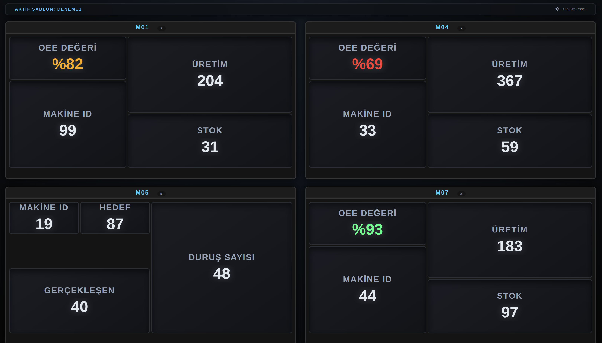
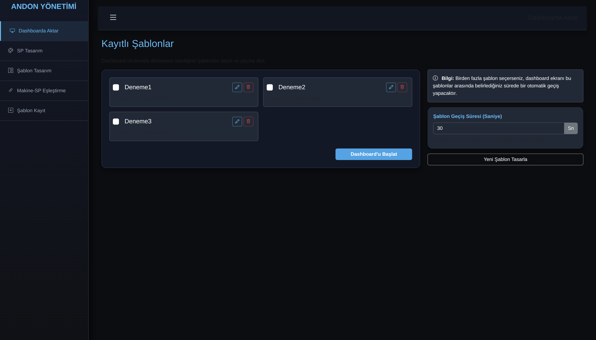
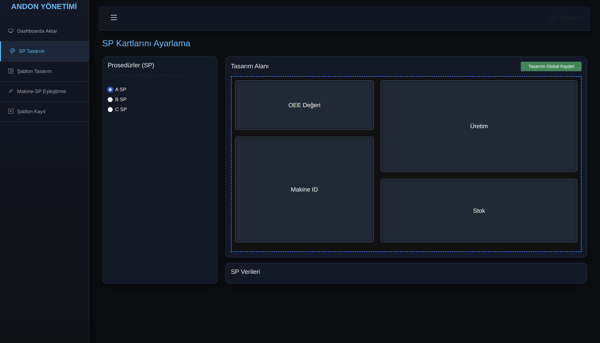
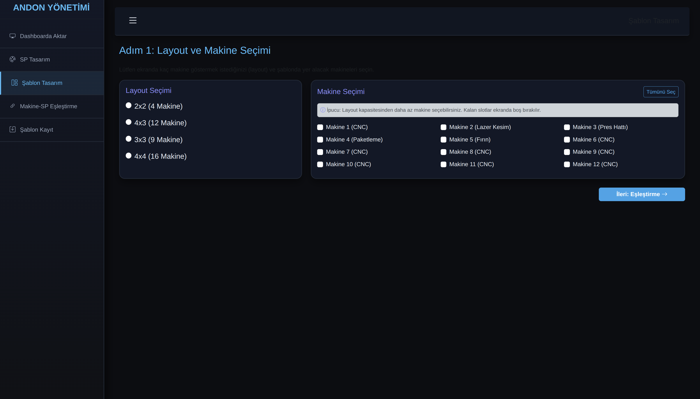
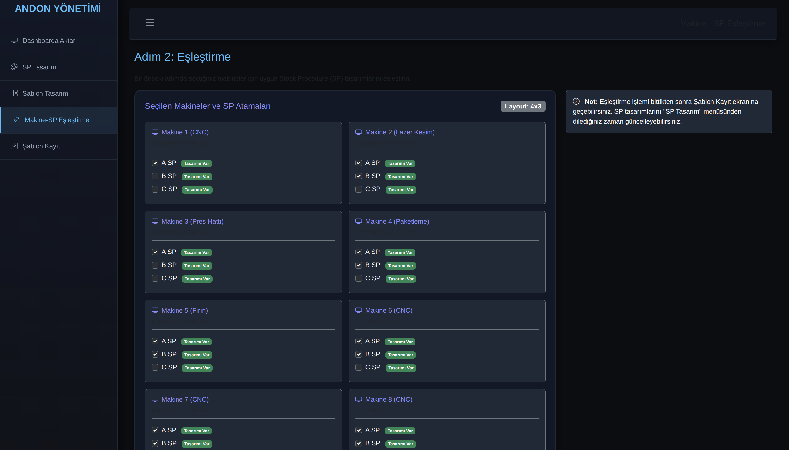

# MES Andon Dashboard

MES (Manufacturing Execution System) Andon Dashboard, üretim sahasındaki makinelerin durumlarını, stok prosedürlerini (SP) ve üretim metriklerini endüstriyel TV ekranlarında veya monitörlerde gerçek zamanlı ve döngüsel olarak sergilemek için geliştirilmiş modern, dinamik ve tam duyarlı (responsive) bir web uygulamasıdır.

## 🚀 Proje Özellikleri

- **Sürükle-Bırak Widget Tasarım Editörü (Gridstack.js):** SP (Stok Prosedürü) ve Şablon tasarımı ekranlarında widget'lar sürükle-bırak mantığı ile yerleştirilebilir, yeniden boyutlandırılabilir (resize) ve tamamen özelleştirilebilir bir ızgara (grid) düzeninde tasarlanabilir.
- **TV ve Büyük Ekran Uyumluluğu:** Uygulama, `vw`, `vh` ve `clamp()` gibi dinamik CSS değerleri kullanarak her türlü ekran çözünürlüğünde (özellikle fabrika TV ekranlarında) bozulmadan, orantılı bir şekilde kendini ölçeklendirir. Taşma (overflow) sorunları tamamen giderilmiştir.
- **Dinamik Şablon (Template) Döngüsü:** Birden fazla dashboard şablonu oluşturulabilir ve bu şablonlar belirlenen süre (saniye) aralıklarında ekranda otomatik olarak döner.
- **Gelişmiş Makine ve SP Eşleştirmesi:**
  - Makinelere birden fazla SP (Stok Prosedürü) atanabilir. (Bire-çok ilişki).
  - Checkbox (onay kutusu) tabanlı kullanıcı dostu arayüz ile eşleştirmeler kolayca yönetilir.
- **Zaman Dilimli SP Gösterimi (Time-slicing):** Bir makineye birden fazla SP atandığında, ekrandaki aktif şablon süresi boyunca bu SP'ler kendi içlerinde sırayla döner. (Örn: Şablon 60 saniye kalacaksa ve makinede 3 SP varsa, her SP 20 saniye boyunca gösterilir).
- **Modüler ve Temiz Mimari:** Projedeki HTML (CSHTML), CSS ve JavaScript dosyaları birbirinden tamamen ayrıştırılmıştır (Decoupled). View'lar üzerinde inline stil veya script bulunmaz; veriler JavaScript'e `data-*` attribute'ları aracılığıyla aktarılır.

## 🛠️ Kullanılan Teknolojiler

- **Backend / Çerçeve:** ASP.NET Core MVC (.NET 9.0)
- **Frontend Mimari & Kütüphaneler:** 
  - HTML5, Vanilla JavaScript, CSS3
  - **Gridstack.js:** Sürükle-bırak interaktif grid/widget mizanpaj yönetimi
- **Stil & Tasarım:** 
  - CSS Grid ve Flexbox ile modern mizanpaj yönetimi
  - Viewport birimleri ve Fluid Typography ile duyarlı (responsive) tasarım
- **Veri Kaynağı:** Geçici olarak `Data/andonData.json` dosyası üzerinden JSON formatında okunmaktadır.
- **Gerçek Zamanlı İletişim (Hazırlık):** SignalR altyapısı (Hubs) gelecekteki canlı veri akışı için projede tanımlanmıştır.

## 📁 Klasör ve Sayfa Yapısı

- `DashboardaAktar`: Şablonların dashboard ekranında dönmesi için seçildiği ve sürelerinin ayarlandığı ekran.
- `SpTasarim`: SP'lerin (Stok Prosedürleri) görsel tasarımı ve yönetimi.
- `SablonTasarim`: Dashboard şablonlarının oluşturulduğu alan.
- `MakineSpEslesme`: Hangi makinede hangi SP'lerin döneceğinin belirlendiği checkbox tabanlı eşleştirme ekranı.
- `SablonKayit`: Oluşturulan tasarımların taslak veya kalıcı olarak kaydedildiği alan.
- `Dashboard`: Üretim sahasına yansıtılacak olan, döngülerin ve widget'ların çalıştığı ana vizyon ekranı.

## 💻 Kurulum ve Çalıştırma

1. Projeyi bilgisayarınıza indirin (veya clone'layın).
2. Terminal veya Komut İstemcisi üzerinden proje dizinine (`/home/dombayli/MES-Andon-Dashboard/Project` veya .sln dosyasının bulunduğu dizin) gidin.
3. Gerekli bağımlılıkları yüklemek için:
   ```bash
   dotnet restore
   ```
4. Projeyi çalıştırmak için:
   ```bash
   dotnet run
   ```
5. Tarayıcınızda terminalde belirtilen adrese (genellikle `http://localhost:5000` veya `https://localhost:5001`) giderek uygulamaya erişebilirsiniz.

---

**Ekran Görüntüleri**








